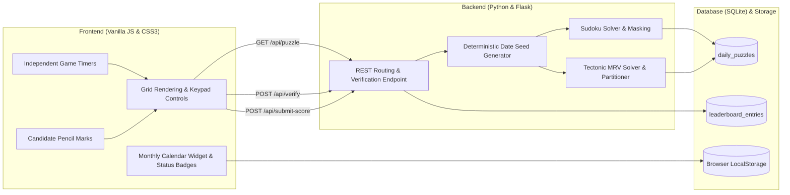

# Daily Logic Puzzles: Sudoku & Tectonic Platform

[](app.py)
[](database/)
[](static/)
[](https://testportalen.se/)

This repository contains a full-stack puzzle platform providing daily seeded Sudoku (9x9) and Tectonic/Suguru (6x6) challenges, featuring independent game timers, an interactive calendar tracking daily completion history, and competitive daily leaderboards inspired by Testportalen.se.

Built as a software engineering passion project focusing on constraint satisfaction problems, polyomino partitioning, REST API design, and client-side state handling.

---

## Overview

The platform serves two daily logic puzzles based on the calendar date:
1. **Sudoku (9x9):** Standard Latin square puzzle with row, column, and 3x3 subgrid uniqueness constraints.
2. **Tectonic / Suguru (6x6):** Grid partitioned into contiguous polyomino cages of sizes 3 to 5. Each cage of size N contains digits 1 to N without duplicate values. In accordance with Suguru rules, no two identical digits may touch in any of the 8 surrounding cardinal or diagonal directions (`max(|dr|, |dc|) <= 1`).
3. **Daily Seeding:** Puzzles are deterministically generated from SHA-256 date hashes, ensuring all players globally receive identical daily boards.
4. **Independent Game States & Timers:** Sudoku and Tectonic maintain fully independent timers and board states. Switching tabs pauses the outgoing game timer and resumes the incoming timer.
5. **Interactive Calendar History:** A calendar interface tracks completion status per date and per game type:
   - Green badge (Klar i tid): Puzzle completed on its scheduled date.
   - Yellow badge (Klar i efterhand): Puzzle completed retroactively for past dates.
   - Highlights active date selection with blue ring and persists completion status via `localStorage`.

---

## Architecture



---

## Game Engine Mechanics

### 1. Sudoku Engine (`core/sudoku_engine.py`)
* Generation: Employs randomized backtracking seeded with `YYYY-MM-DD:sudoku`. Diagonal 3x3 blocks are generated independently, followed by recursive constraint propagation to complete the Latin square.
* Masking: Cells are removed deterministically down to 33 clues for daily balance.
* Verification: Server validates row, column, and block uniqueness before accepting submissions.

### 2. Tectonic / Suguru Engine (`core/tectonic_engine.py`)
* Partitioning: 36 cells are segmented into 8 polyomino cages of sizes 3 to 5 ($4 \times 5 + 4 \times 4$ or equivalent combinations).
* Solver: Implements a Minimum Remaining Values (MRV) heuristic with 8-directional Chebyshev distance checking. Cells with the fewest legal digit candidates are prioritized to eliminate deep backtracking dead ends.
* Clues: Masks 22 cells, providing 14 initial numbers for the daily challenge.

---

## REST API Specification

### 1. Get Daily Puzzle
* **Endpoint:** `GET /api/puzzle?type={sudoku|tectonic}&date={YYYY-MM-DD}`
* **Response:**
```json
{
  "puzzle_id": 1,
  "date_key": "2026-09-21",
  "puzzle_type": "sudoku",
  "initial_board": [[0, 0, 3, ...], ...],
  "metadata": { "clues_count": 33 }
}
```
*Note: Solutions are excluded from client payloads to prevent client-side inspection.*

### 2. Verify Board State
* **Endpoint:** `POST /api/verify`
* **Payload:** `{ "date_key": "2026-09-21", "puzzle_type": "sudoku", "board": [[...]] }`
* **Response:** `{ "valid": true, "completed": false, "errors": [] }`

### 3. Submit Score
* **Endpoint:** `POST /api/submit-score`
* **Payload:**
```json
{
  "date_key": "2026-09-21",
  "puzzle_type": "sudoku",
  "player_name": "Solver_99",
  "time_seconds": 184.5,
  "board": [[...]]
}
```
* **Response:** `{ "success": true, "entry": { "rank": 1, "player_name": "Solver_99", "time_seconds": 184.5 } }`

### 4. Fetch Leaderboard
* **Endpoint:** `GET /api/leaderboard?type={sudoku|tectonic}&date={YYYY-MM-DD}`
* **Response:** Sorted by `completion_time_seconds ASC`.

---

## Client Controls

* **Cell Selection:** Mouse click or Arrow Keys (`Up`, `Down`, `Left`, `Right`).
* **Digit Input:** Keyboard numbers `1`–`9` (Sudoku) or `1`–`5` (Tectonic), or on-screen keypad.
* **Erase / Clear:** `Backspace`, `Delete`, or `0`.
* **Pencil Mode Toggle:** Press `P` or toggle the Pen / Pencil button to record mini candidate notes in cells.
* **Calendar Selection:** Click any past or current calendar day to load that specific puzzle date.

---

## Repository Structure

```text
daily-logic-puzzles/
│
├── README.md                      # Technical documentation and system architecture
├── requirements.txt               # Dependencies (Flask)
├── .gitignore                     # Git configuration
├── app.py                         # Flask server and REST routing
│
├── core/
│   ├── sudoku_engine.py           # Sudoku generator, solver, and validator
│   ├── tectonic_engine.py         # Tectonic Suguru MRV solver and cage partitioner
│   └── daily_seed.py              # SHA-256 deterministic date seed generator
│
├── database/
│   ├── db.py                      # SQLite database interface and queries
│   └── schema.sql                 # Table definitions and index setup
│
├── static/
│   ├── css/
│   │   └── style.css              # Nordic minimalist layout, calendar widget, and board styles
│   └── js/
│       └── app.js                 # State manager, calendar widget, timer controller
│
├── templates/
│   └── index.html                 # Single-page interface layout
│
└── tests/
    └── test_engines.py            # Automated test suite for engines and database
```

---

## Reproduction & Local Execution

To run the application locally:

```bash
# 1. Clone repository
git clone https://github.com/kallt/daily-logic-puzzles.git
cd daily-logic-puzzles

# 2. Install dependencies
pip install -r requirements.txt

# 3. Run unit tests
python tests/test_engines.py

# 4. Start local Flask server
python app.py
```

Navigate to `http://127.0.0.1:5000` in any web browser to play.

---

## Author

* GitHub: [kallt](https://github.com/kallt)
