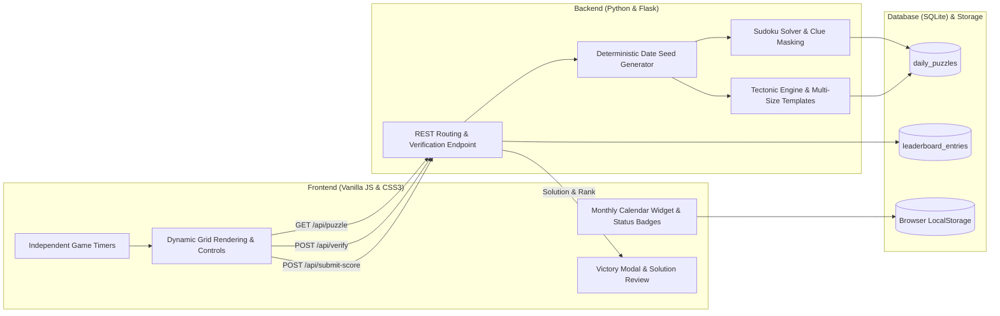

# Daily Logic Puzzles: Sudoku & Tectonic Platform

[](app.py)
[](database/)
[](static/)
[](https://testportalen.se/)

This repository contains a full-stack logic puzzle platform providing daily seeded Sudoku (9x9) and Tectonic/Suguru (6x6 to 9x9) challenges, featuring independent game timers, an interactive calendar tracking completion history, Testportalen-style board styling with bottom-left cage sizes, and a completion screen with solution review and daily leaderboards.

Built as a software engineering portfolio project focusing on constraint satisfaction, polyomino partitioning, REST API architecture, and client-side state synchronization.

---

## Overview

The application delivers deterministic daily challenges based on calendar dates:
1. **Sudoku (9x9):** Classical Latin square logic puzzle with row, column, and 3x3 block uniqueness constraints.
2. **Tectonic / Suguru (Dynamic 6x6 to 9x9):**
   - Grids vary day-to-day between 6x6, 7x7, 8x8, and 9x9.
   - Rotates through three difficulty tiers: `Lätt` (~48% clues), `Medel` (~36% clues), and `Svår` (~26% clues).
   - Each cell displays its cage capacity in the bottom-left corner (`cage-size-num`), replacing top-corner badges.
   - Polyomino cages contain digits from 1 to N with no duplicates, adhering strictly to 8-direction Chebyshev adjacency rules (`max(|dr|, |dc|) <= 1`).
3. **Deterministic Seeding:** SHA-256 date hashing guarantees consistent boards for all players on any given date.
4. **Independent Game States & Timers:** Sudoku and Tectonic operate on isolated stopwatches and board caches. Switching tabs automatically pauses the inactive puzzle and resumes the active one.
5. **Interactive Calendar History:** Tracks completion status per puzzle type:
   - Green indicator (`status-ontime`): Solved on the scheduled challenge date.
   - Yellow indicator (`status-retro`): Solved retroactively for past calendar dates.
   - Local state persists across sessions via `localStorage`.
6. **Victory & Solution Review Screen:**
   - Purple header card with achievement trophy, difficulty tier pill, and Swedish date formatting (`21 september 2026`).
   - Side-by-side metric cards displaying official time (`TID`) and leaderboard placement (`PLACERING`).
   - `RÄTT LÖSNING` section rendering the solved board with pastel cage tints and cage borders.
   - Inline score submission to the SQLite daily leaderboard.

---

## Architecture



---

## Game Engine Mechanics

### 1. Sudoku Engine (`core/sudoku_engine.py`)
- Generation: Backtracking algorithm seeded with `YYYY-MM-DD:sudoku`. 3x3 diagonal blocks are populated first, followed by recursive constraint propagation.
- Clue Masking: Reduces cells deterministically to 33 clues for standard daily difficulty.
- Validation: Validates row, column, and subgrid uniqueness constraints server-side.

### 2. Tectonic / Suguru Engine (`core/tectonic_engine.py`)
- Grid Partitioning: Polyomino cage library covering 6x6 (36 cells), 7x7 (49 cells), 8x8 (64 cells), and 9x9 (81 cells) layouts with cage sizes ranging from 2 to 5 cells.
- Dynamic Difficulty:
  - `Lätt`: ~48% initial clues.
  - `Medel`: ~36% initial clues.
  - `Svår`: ~26% initial clues.
- Geometric Invariance: Applies dihedral group transformations (rotations by 90, 180, 270 degrees and horizontal/vertical reflections) to expand board diversity while preserving validity.
- Cell Representation: Each cell includes a small cage size indicator in its bottom-left corner and a centralized user input area.

---

## REST API Specification

### 1. Get Daily Puzzle
- **Endpoint:** `GET /api/puzzle?type={sudoku|tectonic}&date={YYYY-MM-DD}`
- **Response:**
```json
{
  "puzzle_id": 1,
  "date_key": "2026-09-21",
  "puzzle_type": "tectonic",
  "initial_board": [[0, 2, 0, ...], ...],
  "metadata": {
    "grid_size": 7,
    "difficulty": "Medel",
    "clues_count": 17,
    "grid_cages": [[0, 0, 1, ...], ...],
    "cages": {
      "0": { "size": 5, "cells": [[0, 0], [0, 1], ...] }
    }
  }
}
```

### 2. Verify Board State
- **Endpoint:** `POST /api/verify`
- **Payload:**
```json
{
  "date_key": "2026-09-21",
  "puzzle_type": "tectonic",
  "time_seconds": 67.0,
  "board": [[...]]
}
```
- **Response (In Progress):** `{ "valid": true, "completed": false, "errors": [] }`
- **Response (Completed):**
```json
{
  "valid": true,
  "completed": true,
  "errors": [],
  "projected_rank": 2,
  "solution_board": [[...]],
  "metadata": { "difficulty": "Lätt", "grid_size": 7 }
}
```

### 3. Submit Score
- **Endpoint:** `POST /api/submit-score`
- **Payload:**
```json
{
  "date_key": "2026-09-21",
  "puzzle_type": "tectonic",
  "player_name": "Solver_99",
  "time_seconds": 67.0,
  "board": [[...]]
}
```
- **Response:**
```json
{
  "success": true,
  "entry": {
    "entry_id": 12,
    "rank": 2,
    "player_name": "Solver_99",
    "time_seconds": 67.0
  }
}
```

### 4. Fetch Leaderboard
- **Endpoint:** `GET /api/leaderboard?type={sudoku|tectonic}&date={YYYY-MM-DD}`
- **Response:** Sorted list of entries with rank, player name, formatted time, and timestamp.

---

## Client Controls

- **Cell Selection:** Mouse click or Arrow Keys (`Up`, `Down`, `Left`, `Right`).
- **Digit Input:** Keyboard numbers `1`–`9` (Sudoku) or `1`–`5` (Tectonic), or on-screen keypad.
- **Erase / Clear:** `Backspace`, `Delete`, or `0`.
- **Pencil Mode Toggle:** Press `P` or toggle the Pen / Pencil button to record mini candidate notes in cells.
- **Calendar Selection:** Click any past or current calendar day to load that specific puzzle date.

---

## Repository Structure

```text
daily-logic-puzzles/
│
├── README.md                      # Technical documentation and system architecture
├── requirements.txt               # Dependencies (Flask)
├── .gitignore                     # Git configuration
├── app.py                         # Flask server and REST routing
│
├── core/
│   ├── sudoku_engine.py           # Sudoku generator, solver, and validator
│   ├── tectonic_engine.py         # Multi-size Tectonic engine, difficulties, and transformations
│   └── daily_seed.py              # SHA-256 deterministic date seed generator
│
├── database/
│   ├── db.py                      # SQLite database interface, ranking, and queries
│   └── schema.sql                 # Table definitions and index setup
│
├── static/
│   ├── css/
│   │   └── style.css              # Testportalen-inspired layout, victory modal, and board styles
│   └── js/
│       └── app.js                 # Independent state controller, victory modal, calendar widget
│
├── templates/
│   └── index.html                 # Single-page interface layout and victory modal
│
└── tests/
    └── test_engines.py            # Automated test suite for multi-size engines and database
```

---

## Reproduction & Local Execution

To run the application locally:

```bash
# 1. Clone repository
git clone https://github.com/kallt/daily-logic-puzzles.git
cd daily-logic-puzzles

# 2. Install dependencies
pip install -r requirements.txt

# 3. Run unit tests
python tests/test_engines.py

# 4. Start local Flask server
python app.py
```

Navigate to `http://127.0.0.1:5000` in any web browser to play.

---

## Author

- GitHub: [kallt](https://github.com/kallt)
