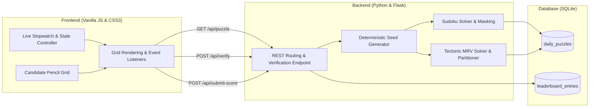

# Daily Logic Puzzles: Sudoku & Tectonic Platform

[](app.py)
[](database/)
[](static/)
[](https://testportalen.se/)

This repository contains a full-stack web application providing daily seeded Sudoku (9x9) and Tectonic/Suguru (6x6) challenges with server-side validation, live timing, and competitive daily leaderboards inspired by Testportalen.se.

Built as a software engineering and algorithm design project focusing on constraint satisfaction problems, polyomino partitioning, REST API architecture, and responsive client-side state handling.

---

## Overview

The platform generates and serves two distinct daily logic puzzles based on the UTC calendar date:
1. **Sudoku (9x9):** Standard Latin square puzzle with row, column, and 3x3 subgrid uniqueness constraints.
2. **Tectonic / Suguru (6x6):** Grid partitioned into contiguous polyomino cages of sizes 3 to 5. Each cage of size N contains digits 1 to N without duplicate values, under the strict rule that no two identical digits may touch in any of the 8 surrounding cardinal or diagonal directions.
3. **Daily Seeding:** Puzzles are deterministically generated from SHA-256 date hashes, ensuring all concurrent players solve identical daily boards.
4. **Anti-Cheat & Clean Solve Classification:** In accordance with competitive standards on Testportalen.se, submissions are verified on the server. Utilizing hint checks flags the solve as Assisted, while unassisted completions qualify for the Clean Solve leaderboard.

---

## Architecture



---

## Game Engine Mechanics

### 1. Sudoku Engine (`core/sudoku_engine.py`)
* Generation: Employs randomized backtracking. Diagonal 3x3 blocks are populated independently first, followed by recursive constraint propagation to complete the Latin square.
* Masking: Cells are removed deterministically down to 33 clues for daily balance.
* Verification: Server validates row, column, and block uniqueness before accepting submissions.

### 2. Tectonic / Suguru Engine (`core/tectonic_engine.py`)
* Partitioning: 36 cells are segmented into 8 polyomino cages of sizes 3 to 5 ($4 \times 5 + 4 \times 4$ or equivalent combinations).
* Solver: Implements a Minimum Remaining Values (MRV) heuristic with 8-directional Chebyshev distance checking (`max(|dr|, |dc|) <= 1`). Cells with the fewest legal digit candidates are prioritized to eliminate deep backtracking dead ends.
* Clues: Masks 22 cells, providing 14 initial numbers for the daily challenge.

---

## REST API Specification

### 1. Get Daily Puzzle
* **Endpoint:** `GET /api/puzzle?type={sudoku|tectonic}&date={YYYY-MM-DD}`
* **Response:**
```json
{
  "puzzle_id": 1,
  "date_key": "2026-09-21",
  "puzzle_type": "sudoku",
  "initial_board": [[0, 0, 3, ...], ...],
  "metadata": { "clues_count": 33 }
}
```
*Note: Solutions are stripped from the response payload to prevent client-side inspection.*

### 2. Verify Board State
* **Endpoint:** `POST /api/verify`
* **Payload:** `{ "date_key": "2026-09-21", "puzzle_type": "sudoku", "board": [[...]] }`
* **Response:** `{ "valid": true, "completed": false, "errors": [] }`

### 3. Submit Score
* **Endpoint:** `POST /api/submit-score`
* **Payload:**
```json
{
  "date_key": "2026-09-21",
  "puzzle_type": "sudoku",
  "player_name": "Solver_99",
  "time_seconds": 184.5,
  "is_clean_solve": true,
  "hints_used": 0,
  "board": [[...]]
}
```
* **Response:** `{ "success": true, "entry": { "rank": 1, "player_name": "Solver_99" } }`

### 4. Fetch Leaderboard
* **Endpoint:** `GET /api/leaderboard?type={sudoku|tectonic}&date={YYYY-MM-DD}`
* **Response:** Sorted by `is_clean_solve DESC, completion_time_seconds ASC`.

---

## Client Controls

* **Cell Selection:** Mouse click or Arrow Keys (`Up`, `Down`, `Left`, `Right`).
* **Digit Input:** Keyboard numbers `1`–`9` (Sudoku) or `1`–`5` (Tectonic), or on-screen keypad.
* **Erase / Clear:** `Backspace`, `Delete`, or `0`.
* **Pencil Mode Toggle:** Press `P` or toggle the Pen / Pencil button to record mini candidate notes in cells.
* **Pause / Resume:** Freezes stopwatch and hides board values during breaks.

---

## Repository Structure

```text
daily-logic-puzzles/
│
├── README.md                      # Technical documentation and system architecture
├── requirements.txt               # Dependencies (Flask)
├── .gitignore                     # Git configuration
├── app.py                         # Flask server and REST routing
│
├── core/
│   ├── sudoku_engine.py           # Sudoku generator, solver, and validator
│   ├── tectonic_engine.py         # Tectonic Suguru MRV solver and cage partitioner
│   └── daily_seed.py              # SHA-256 deterministic date seed generator
│
├── database/
│   ├── db.py                      # SQLite database interface and queries
│   └── schema.sql                 # Table definitions and index setup
│
├── static/
│   ├── css/
│   │   └── style.css              # Nordic minimalist layout, grids, and timer styling
│   └── js/
│       └── app.js                 # State manager, grid rendering, keyboard navigation
│
├── templates/
│   └── index.html                 # Single-page interface layout
│
└── tests/
    └── test_engines.py            # Automated test suite for engines and database
```

---

## Reproduction & Local Execution

To run the application locally:

```bash
# 1. Clone repository
git clone https://github.com/kallt/daily-logic-puzzles.git
cd daily-logic-puzzles

# 2. Install dependencies
pip install -r requirements.txt

# 3. Run unit tests
python tests/test_engines.py

# 4. Start local Flask server
python app.py
```

Navigate to `http://127.0.0.1:5000` in any web browser to play.

---

## Author

* GitHub: [kallt](https://github.com/kallt)
